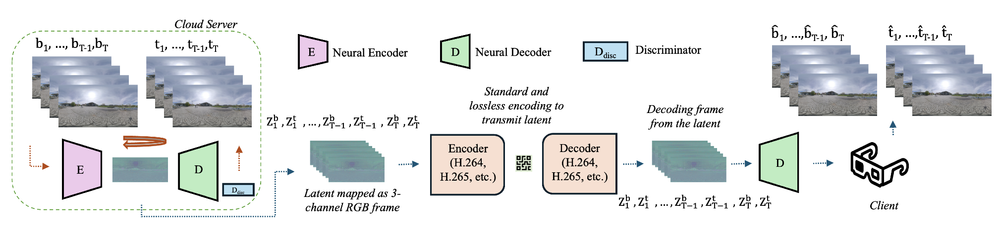
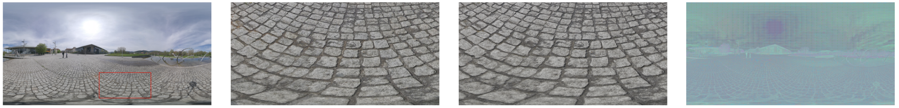
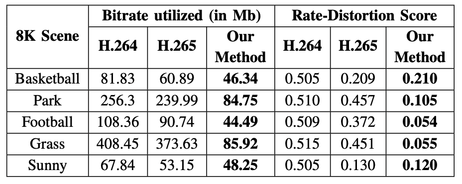

# 8K-stereoscopic-VR-compression



This repo accompanies our research project titled "Compression and Transmission of 8K Stereoscopic
VR using VAE-GAN Latents and Standard Encoders". It contains the core modules and configurations for our experiments to be carried out. Below we document the environment settings. If you need a pretrained model, please email : sampreet.vaidya@ucalgary.ca

### Note:

The experiments were carried out using cloud server contaning NVidia A100 GPUs. We would recommend to use similar GPUs for the experiments as 8K frames parsing takes a lot of time.

## Getting Started

1. Clone the repo:

```bash
git clone https://github.com/sampreetucalgary07/8K-stereoscopic-VR-compression.git

```

2. Install dependencies:

```bash
pip3 install requirements.txt

```

3. Download the 8K stereo dataset from this [paper](https://www.researchgate.net/publication/379125834_Towards_evaluation_of_immersion_visual_comfort_and_exploration_behaviour_for_non-stereoscopic_and_stereoscopic_360_videos). Make sure there is enough space. The videos exceeds 15 GB of space.

4. Place the videos in `data/Videos` while all the corresponding preprocessing steps such as extraction of frames (top-down) should be in `data/video_dataset`. The empty folders have been already created.

5. Update config file according to your experiments or keep it default for corresponding videos, for e.g. ` configs/E2_8K_basketball.yaml`

6. Run `train_vae_model.py `. You can also make use of dynamic scripts files to automate multiple experiments such as ``` dynamic_scripts_video_process.py to carry video preprocessing on all the files.

## Results

Below is the visual comparison of client-side reconstructions. The H.265 encoded frame (second-left) is perceptually very similar to our losslessly transmitted latent-based reconstruction (second-right). Size of the latent frame (rightmost) is equal to red block in the original frame (leftmost).





## References

[1] L. V. Academy, “Monoscopic vs. stereoscopic 360° vr,”
https://vr.linde.com/2022/11/09/monoscopic-vs-stereoscopic-360-vr/,
accessed 2023-08-21.
[2] S. Zhao, H. Abou-zeid, R. Atawia, Y. S. K. Manjunath, A. B. Sediq, and
X.-P. Zhang, “Virtual reality gaming on the cloud: A reality check,” in
2021 IEEE Global Communications Conference (GLOBECOM), 2021.
[3] B. Liu, Y. Chen, S. Liu, and H.-S. Kim, “Deep learning in latent space
for video prediction and compression,” in 2021 IEEE/CVF Conference
on Computer Vision and Pattern Recognition (CVPR), 2021.
[4] Z. Chen, G. Lu, Z. Hu, S. Liu, W. Jiang, and D. Xu, “Lsvc: A learning-
based stereo video compression framework,” in 2022 IEEE/CVF Con-
ference on Computer Vision and Pattern Recognition (CVPR), 2022.
[5] Y. Hu, O. G. Guleryuz, P. A. Chou, D. Tang, J. Taylor, R. Maxham,
and Y. Wang, “One-click upgrade from 2d to 3d: Sandwiched rgb-d
video compression for stereoscopic teleconferencing,” in CVPR 2024
Workshop (AIS: Vision, Graphics and AI for Streaming), 2024.
[6] R. Birman, Y. Segal, and O. Hadar, “Overview of research in the field
of video compression using deep neural networks,” Multimedia Tools
and Applications, vol. 79, p. 11699–11722, 2020.
[7] Meta, “Encoding immersive videos for meta quest 2,”
https://creator.oculus.com/getting-started/media-production-
specifications-for-delivery-to-meta-quest-2-headsets/, accessed 2023-11- 16.
[8] S. Fremerey, R. F. U. Zaman, T. Ashraf, R. R. R. Rao, S. G¨oring, and
A. Raake, “Towards evaluation of immersion, visual comfort and explo-
ration behaviour for non-stereoscopic and stereoscopic 360° videos,” in
2023 IEEE International Symposium on Multimedia (ISM), 2023.
[9] S. Vaidya, H. Abou-Zeid, and D. Krishnamurthy, “Transfer learning
for online prediction of virtual reality cloud gaming traffic,” in 2023
IEEE Global Communications Conference (GLOBECOM), 2023, p.
4668–4673.
[10] Q. Hou, F. Farhadzadeh, A. Said, G. Sautiere, and H. Le, “Low-latency
neural stereo streaming,” in 2024 IEEE/CVF Conference on Computer
Vision and Pattern Recognition (CVPR), 2024, pp. 7974–7984.
[11] D. P. Kingma and M. Welling, “Auto-encoding variational bayes,” 2013.
[12] R. Zhang, P. Isola, A. A. Efros, E. Shechtman, and O. Wang, “The
unreasonable effectiveness of deep features as a perceptual metric,” in
2018 IEEE/CVF Conference on Computer Vision and Pattern Recogni-
tion, 2018, p. 586–595.
[13] P. Isola, J.-Y. Zhu, T. Zhou, and A. A. Efros, “Image-to-image translation
with conditional adversarial networks,” in 2017 IEEE Conference on
Computer Vision and Pattern Recognition (CVPR), 2017, p. 5967–5976.
[14] L. Theis, T. Salimans, M. D. Hoffman, and F. Mentzer, “Lossy com-
pression with gaussian diffusion,” 2022.
[15] C. Hewage, 3D video processing and transmission fundamentals. book-
boon, 01 2014.
